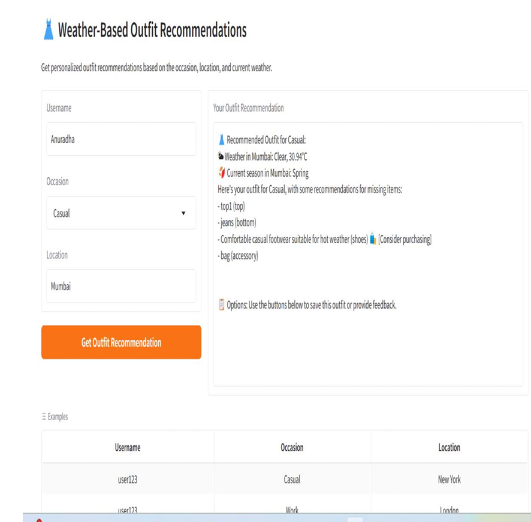
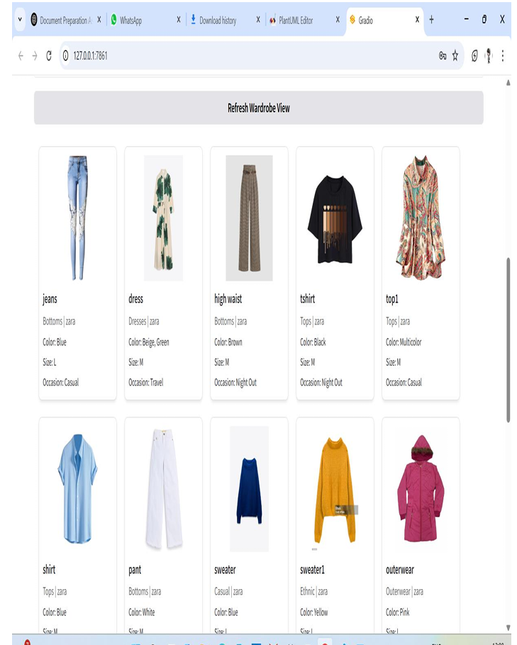

# Smart Wardrobe AI Assistant

AI-powered Smart Wardrobe Assistant built using Python and Gradio. This application helps users manage their wardrobe and get outfit recommendations based on preferences, occasions, and usage.

---

## 🚀 Live Features Demonstration
- Multi-feature AI wardrobe system
- Modular architecture (7 independent features)
- Interactive UI using Gradio

---

## 🧠 ML Concepts Used
- Recommendation systems (rule-based + data-driven)
- Data preprocessing
- Feature-based filtering

---

## 🚀 Features

- User Management  
- Wardrobe Management  
- Outfit Recommendation  
- Styling Suggestions  
- Laundry Tracker  
- Packing Assistant  
- Shopping Platform Discovery  

---

## 📸 Application Preview

### Outfit Recommendation

### Wardrobe Management

---

## 🎥 Project Demo Video

👉 [Click here to watch demo](https://drive.google.com/file/d/1agPG4DFnoY5pl7RbgLVo_TeKr19kVcrj/view?usp=drive_link)

---

## 🛠️ Tech Stack

- Python  
- Gradio (UI)  
- NumPy, Pandas  
- JSON / CSV (Data handling)  
- Git & GitHub  

---

## 📁 Project Structure
